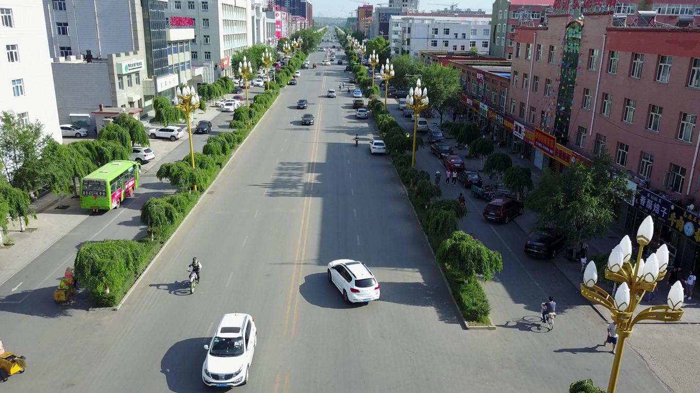
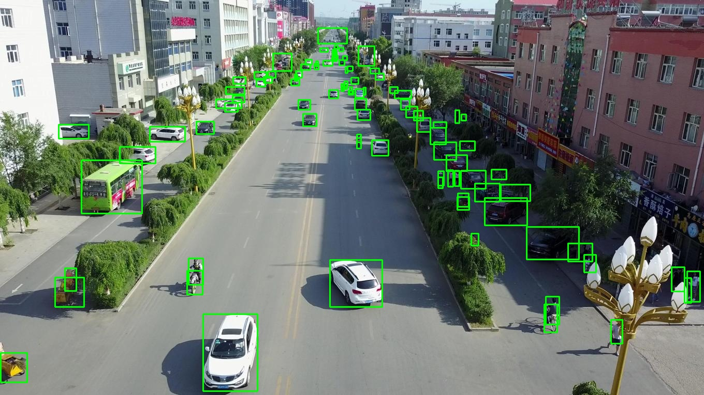
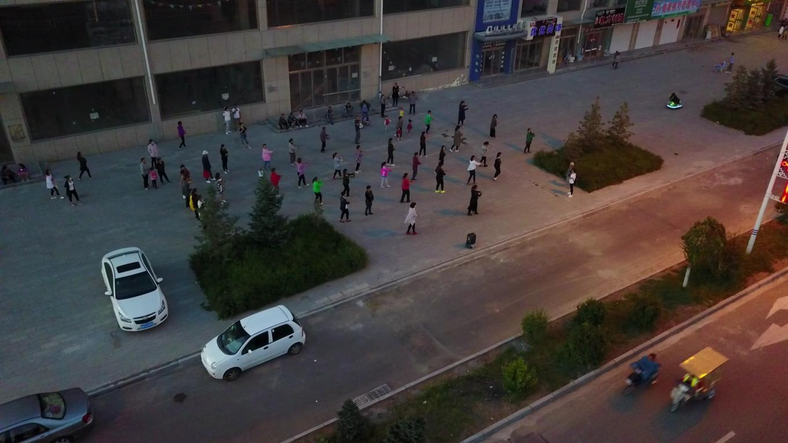
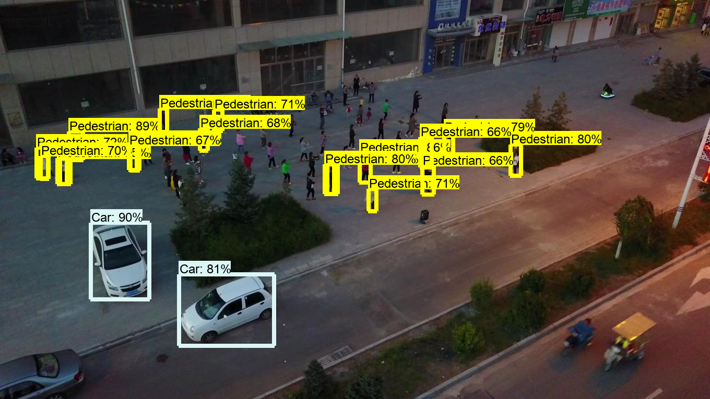
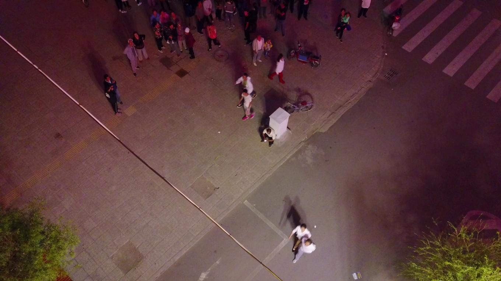
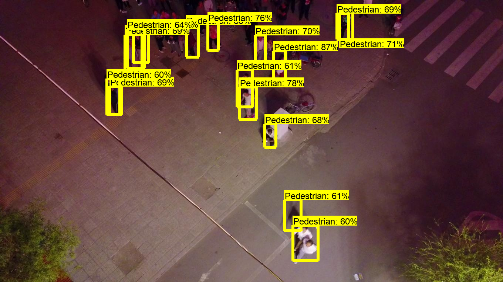

# VisDrone-dataset-python-toolkit

### MAJOR REFACTOR UPDATE

This repo has just been updated massively, the new code is now available for all, please note that the rcnn script is still under scrutiny.

This repository provides a basic Pythonic toolkit for the VisDrone-Dataset (2018).
Here, I have converted the existing annotations from the dataset to PASCAL-VOC format (regular .xml files). As of now, only object detection in images has been tackled, I'll be developing Pythonic support for other tasks very soon.

## Original Annotations

The original annotations seem to follow this particular style:

     <bbox_left>,<bbox_top>,<bbox_width>,<bbox_height>,<score>,<object_category>,<truncation>,<occlusion>


        Name                                                  Description
    -------------------------------------------------------------------------------------------------------------------------------
     <bbox_left>	     The x coordinate of the top-left corner of the predicted bounding box

     <bbox_top>	     The y coordinate of the top-left corner of the predicted object bounding box

     <bbox_width>	     The width in pixels of the predicted object bounding box

    <bbox_height>	     The height in pixels of the predicted object bounding box

       <score>	     The score in the DETECTION file indicates the confidence of the predicted bounding box enclosing
                         an object instance.
                         The score in GROUNDTRUTH file is set to 1 or 0. 1 indicates the bounding box is considered in evaluation,
                         while 0 indicates the bounding box will be ignored.

    <object_category>    The object category indicates the type of annotated object, (i.e., ignored regions(0), pedestrian(1),
                         people(2), bicycle(3), car(4), van(5), truck(6), tricycle(7), awning-tricycle(8), bus(9), motor(10),
                         others(11))

    <truncation>	     The score in the DETECTION result file should be set to the constant -1.
                         The score in the GROUNDTRUTH file indicates the degree of object parts appears outside a frame
                         (i.e., no truncation = 0 (truncation ratio 0%), and partial truncation = 1 (truncation ratio 1% ~ 50%)).

    <occlusion>	     The score in the DETECTION file should be set to the constant -1.
                         The score in the GROUNDTRUTH file indicates the fraction of objects being occluded (i.e., no occlusion = 0
                         (occlusion ratio 0%), partial occlusion = 1 (occlusion ratio 1% ~ 50%), and heavy occlusion = 2
                         (occlusion ratio 50% ~ 100%)).

---

## Conversion to PASCAL-VOC

So this annotation format is converted to PASCAL-VOC using `convertVis_to_xml.py`. The directory structure that needs to be followed is mentioned below:

```
VisDrone2019-DET-train
---annotations
---images

convertVis_to_xml.py
```

So if you just execute this code (`python3 convertVis_to_xml.py`) from outside the `VisDrone2019-DET-train`, it will automatically find all the files and corresponding annotations and create two new folders inside the `VisDrone2019-DET-train` directory like below:

```
VisDrone2019-DET-train
---annotations
---images
---images_xml
---annotations_xml

convertVis_to_xml.py
```

The folders with `_xml` extension have the files required for further manipulations. A sample visualization is shown below:

|     Original Image     | With PASCAL-style bounding boxes |
| :--------------------: | :------------------------------: |
|  |           |

## Tensorflow's Object Detection API

The annotations seem to be decent enough. A further confirmation is provided by the following results after training a Faster-RCNN-InceptionV3 object detection algorithm on the customized dataset.

| Original Image  |  Detection Results  |
| :-------------: | :-----------------: |
|  |  |
|  |  |

For replicating these results, please clone this repository and just execute:
`python3 vis-drone-faster-rcnn.py`. This code is meant for static images and will save the output to the same directory. A sample trained model is provided in the `inference_graph` directory.

For now, the code `convertVis_to_xml.py` creates two new folders and puts the data in them, but this can be changed by altering the write folders in the code. This should be customized as per needs of the user. Thank you and happy coding !!!

## References

https://github.com/VisDrone/VisDrone-Dataset
